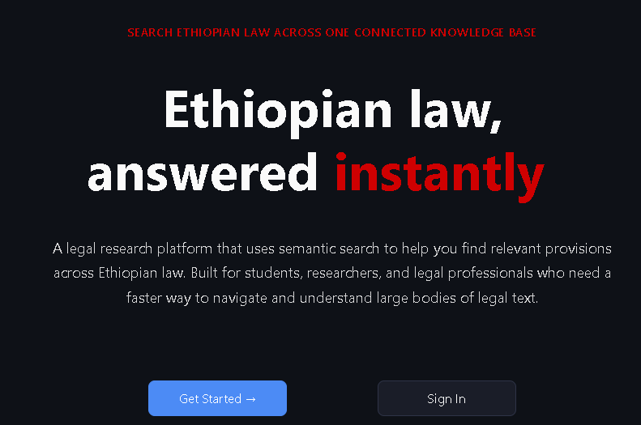
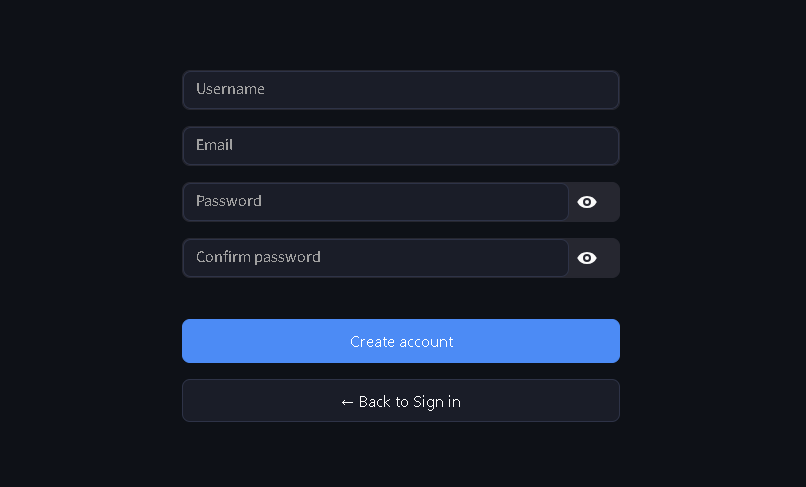
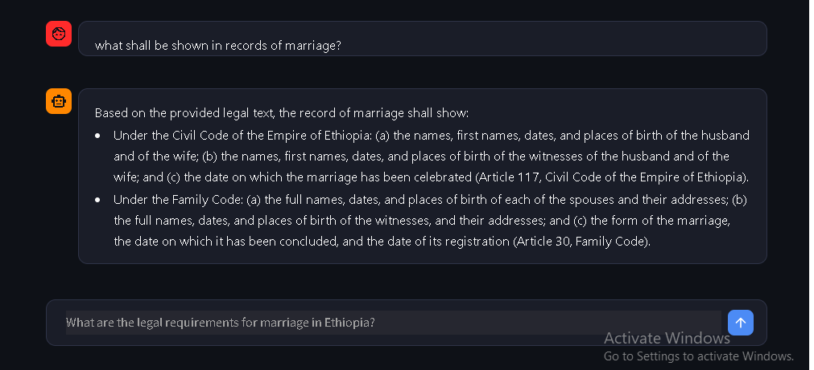

# ⚖️ Ethiopian Legal RAG Assistant

An AI-powered legal research platform that lets you ask questions about Ethiopian law in plain language and get precise, cited answers. It uses semantic search over a fully embedded knowledge base of Ethiopian legal codes to find relevant articles, then generates grounded answers with Gemini.


---

## Screenshots

| Landing Page | Chat Interface | Auth |
|---|---|---|
|  |  |  |

---

## What's inside

| Layer | Technology |
|---|---|
| UI | Streamlit |
| LLM | Google Gemini (via `google-genai`) |
| Embeddings | Fine-tuned multilingual-e5-small (384-dim, local model) |
| Vector search | PostgreSQL + pgvector |
| PDF parsing | pdfplumber |
| Auth | bcrypt |

**Legal corpus indexed:**
- Constitution of the Federal Democratic Republic of Ethiopia (1995)
- Civil Code (1960)
- Criminal Code (2004)
- Commercial Code — old (1960) and new (2021)
- Family Code
- Maritime Code
- Civil Procedure Code

---

## Quickstart

### 1. Clone the repo

```bash
git clone https://github.com/YOUR_USERNAME/ethiopian-legal-rag.git
cd ethiopian-legal-rag
```

### 2. Create a virtual environment

```bash
python -m venv .venv

# Windows
.venv\Scripts\activate

# macOS / Linux
source .venv/bin/activate
```

### 3. Download the embedding model

The fine-tuned embedding model weights are not stored in this repo (465 MB). Download them from HuggingFace and place them at `e5-multilingual-small-law-deploy/`:

```bash
# Install the HuggingFace CLI if you don't have it
pip install huggingface_hub

# Download the model
python -c "
from huggingface_hub import snapshot_download
snapshot_download(
    repo_id='RARAS-Tech/e5-multilingual-small-law',
    local_dir='e5-multilingual-small-law-deploy'
)
"
```

> **Don't have the model yet?** Contact the maintainer for the HuggingFace repo link, or provide the model files directly.

### 4. Install dependencies

```bash
pip install -r requirements.txt
```

> **Note on PyTorch:** The pinned version `torch==2.13.0` is the CUDA 12.6 build.
> If you don't have a GPU or have a different CUDA version, install the right build first:
> ```bash
> # CPU only
> pip install torch --index-url https://download.pytorch.org/whl/cpu
> # Then install the rest
> pip install -r requirements.txt --ignore-installed torch
> ```

### 5. Set up environment variables

```bash
cp .env.example .env
```

Open `.env` and fill in your values:

```env
GOOGLE_API_KEY=your_google_api_key_here

PGHOST=...
PGPORT=5432
PGDATABASE=...
PGUSER=...
PGPASSWORD=...
```

- **Google API key** → [aistudio.google.com/app/apikey](https://aistudio.google.com/app/apikey) (free)
- **Database credentials** → see section below

### 6. Connect to the hosted database

The legal corpus — all PDFs parsed, chunked, and embedded — is already loaded into a hosted PostgreSQL instance with pgvector. You do **not** need to run ingestion yourself.

**Contact the maintainer for the database credentials** and drop them into your `.env`.  
The database contains:
- ~5,000+ article chunks with 384-dim embeddings
- Hierarchical legal containers (Books, Parts, Titles, Chapters, Sections)
- Full metadata for all 7 legal codes

### 7. Run the app

```bash
streamlit run main.py
```

Open [http://localhost:8501](http://localhost:8501) in your browser.

---

## How it works

```
User question
     │
     ▼
Rewrite to formal legal query (Gemini)
     │
     ▼
Embed query  ──►  Search legal_containers (top 3)
                       │
                       ▼
                  Search chunks inside each container (top 9 each)
                       │
                  Search chunks globally (top 5 direct)
                       │
                       ▼
                  Rerank all candidates → keep top 12
     │
     ▼
Build RAG prompt with retrieved articles
     │
     ▼
Generate cited answer (Gemini)
```

---

## Folder structure

```
ethiopian-legal-rag/
├── main.py                   # Streamlit UI + retrieval orchestration
├── auth.py                   # Register / login (bcrypt)
├── db_pgvector.py            # All DB operations (chunks, containers, users, chats)
├── embedding.py              # Local sentence-transformer wrapper
├── local_llm.py              # Gemini client with fallback model logic
├── legal_pdf_parser.py       # PDF → hierarchical containers + article chunks
├── ingest_to_pg.py           # One-time ingestion script (already run, see below)
├── eval_retrieval.py         # Retrieval evaluation harness
├── generate_questions.py     # Eval dataset generator
├── requirements.txt
├── .env.example
├── assets/
│   ├── logo.png
│   └── demo.mp4
├── pdfs/
│   ├── metadata.json         # Document titles, categories, skip-page config
│   └── Ethiopian-Codes/
│       └── metadata.json
├── e5-multilingual-small-law-deploy/   # Local embedding model weights
└── dev/                      # Dev/debug scripts (not needed to run the app)
```

---

## Running ingestion yourself (optional)

If you want to build your own database from scratch instead of using the hosted one:

1. Install PostgreSQL and enable the pgvector extension:
   ```sql
   CREATE EXTENSION vector;
   ```

2. Place PDFs in `pdfs/` and update `pdfs/metadata.json` with their details.

3. Run ingestion:
   ```bash
   # Ingest all PDFs in a folder
   python ingest_to_pg.py --pdfs-dir pdfs/ --verbose

   # Or ingest a single file
   python ingest_to_pg.py --pdf pdfs/Ethiopian-Codes/Civil_Code.pdf --verbose
   ```

   This will parse each PDF into hierarchical containers and article-level chunks, embed them with the local model, and upsert everything into Postgres. Expect it to take a while depending on corpus size.

---

## Environment variables reference

| Variable | Required | Description |
|---|---|---|
| `GOOGLE_API_KEY` | ✅ | Gemini API key from Google AI Studio |
| `PGHOST` | ✅ | PostgreSQL host |
| `PGPORT` | ✅ | PostgreSQL port (default `5432`) |
| `PGDATABASE` | ✅ | Database name |
| `PGUSER` | ✅ | Database user |
| `PGPASSWORD` | ✅ | Database password |

---

## Retrieval parameters

Tunable at the top of `main.py`:

```python
TOP_CONTAINERS  = 3   # How many top-level legal sections to retrieve
CHUNKS_PER_CONT = 9   # Articles fetched per section
DIRECT_CHUNKS   = 5   # Additional direct chunk search (no container filter)
MAX_CHUNKS      = 12  # Hard cap on context sent to the LLM
```

---

## License

© 2025 RARAS Technology. All rights reserved.
